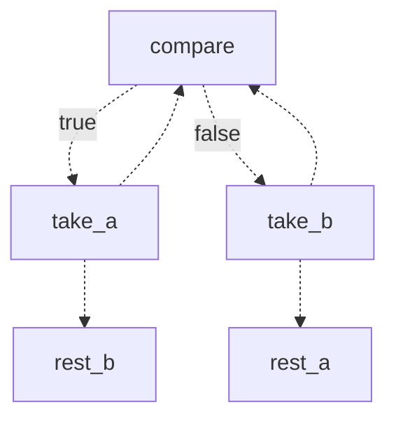

# flow
A flow reads like procedural code: every node is a plain function that takes the results of the functions it depends on. The flow runs them in topological order, whatever order they are added in, and independent nodes run at the same time. Edges draw the arrows of a flowchart on top, for branches and loops.

[Basics](#flow) · [Controlling a run](#controlling-a-run) · [Common patterns](#common-patterns) · [Advanced](#advanced) · [When features meet](#when-features-meet) · [API tables](https://github.com/artxe/lube-series/blob/master/packages/async-lube/docs/reference.md#flow)

```ts
import { flow } from "async-lube"
import type { NodeContext } from "async-lube"

const get_cart = () => api.get<Cart>("/cart")
const get_user = () => api.get<User>("/me")
const get_quote = (cart: Cart, user: User) => api.post<Quote>("/quotes", { items: cart.items, user: user.id })
const otp = flow.input<string>("otp")
const pay = (quote: Quote, code: string, { signal }: NodeContext) =>
    api.post<Receipt>("/payments", { code, quote: quote.id }, { idempotent: true, signal })

const checkout = flow()
    .add(get_cart)
    .add(get_user)
    .add(get_quote, get_cart, get_user) // get_quote(cart, user), after both
    .add(otp, get_quote, { timeout: 180000 })
    .add(pay, get_quote, otp, { overlap: "ignore" }) // pay(quote, code), and a second code while paying is ignored

const run = checkout.run()

run.status // "running", then "waiting" for the otp
otpForm.onsubmit = () => {
    // sending to an input that is done runs its dependents again, so accept one code at a time
    if (run.nodes.otp == "waiting") run.send(otp, otpInput.value)
}

const receipt = await run // the result of the last added node
run.get(get_quote) // the result of any node

flow().add(get_quote, get_user, get_cart) // No overload matches this call.ts(2769)
```
- The arguments are checked against the results of the dependencies, and after them a function receives the context: `{ attempt, goto, index, key, name, previous, signal, skip, sleep, state }`. The state is `unknown` unless the flow declares it: `flow<State>()`.
- Options come last. An unknown option, dependencies in an array, an invalid value or an option that another one makes useless, e.g. `optional` next to `catch`, throws when the node is added, and a circular dependency or a dependency that is not added when the flow runs. TypeScript marks an unknown option, and a function whose last parameter would get the context but is not typed `NodeContext`, which is a missing dependency: `.add(greet, get_meetup)` for `greet(meetup: Meetup, guest: Guest)`. `flow().check()` finds them without running anything, e.g. in a test, with the nodes that never start, a race against a stream or a node that a stream runs again, which the first value wins, `finish` on a node that no race can abandon, and the nodes that a snapshot cannot find because their names come from their place.
- A node is known by its function, input, flow or stream: `run.get(get_quote)`, `run.reload(get_quote)`, `goto(get_quote)`. `run.nodes`, `run.results`, `run.errors` and snapshots use its name: the `name` option or the name of the function or input, `node` for an anonymous function, `input` for an input without a name, `flow` for a flow and `stream` for a stream, with a suffix such as `_2` when it repeats.
- A flow is immutable: `add` and `edge` return a new flow, and one flow can run many times at once.
- An input or a stream that a node depends on is added with its name if it is not added yet, so `.add(pay, get_quote, otp)` is enough. Adding it later, e.g. with a `timeout`, replaces the automatic one in its place before its dependent, so it does not become the last added node.

## Controlling a run
```ts
const run = dashboard.run(state, { signal: controller.signal })

run.status // "running" | "waiting" | "done" | "failed" | "cancelled"
run.nodes // { get_user: "done", get_prices: "running", render: "idle" }
run.reload(get_prices) // runs get_prices and its dependents again, e.g. on pull to refresh
run.retry() // runs what failed again with all its retries, and keeps every result that succeeded
run.cancel() // aborts the running nodes and rejects with CancelError
await run // resolves when no node is running or waiting, and again after reload, retry or send
run.catch(show_error) // like a promise, and a failure that nobody handles is an unhandled rejection
await run.idle() // resolves when nothing runs: done, failed, cancelled or waiting for an input
const stop = run.subscribe(render) // called after every change, e.g. to draw the progress

// every attempt, retry and skip of every node, and only the skip of an input or a stream, e.g. for logs or OpenTelemetry spans
checkout.run(cart, { trace: e => console.log(e.type, e.node, e.attempt, "duration" in e ? e.duration : "") })
```
The context's `signal` aborts when the node restarts, times out, loses a race, or the run fails or is cancelled, so pass it to `api` requests. `sleep(ms)` rejects as soon as the node is cancelled, and `previous` is its last result before it restarted.

A failure that nobody handles is an unhandled rejection. `subscribe` and `idle` watch the run, so after either one no failure is, and after `catch` or `then` with a rejection handler a failure of a run that a stream started again is not: read `status` and `errors`.

`run.errors` holds the errors that go with the current results: a node that runs again, e.g. in the next round of a loop, or is skipped by it drops its error with its result, so log every failure with `trace`.

`subscribe` makes a run a store that every framework reads, because `nodes`, `results` and `errors` return the same object until the next change:
```ts
const nodes = useSyncExternalStore(run.subscribe, () => run.nodes) // React
const store = { subscribe: (r: (v: typeof run.nodes) => void) => (r(run.nodes), run.subscribe(() => r(run.nodes))) } // Svelte
```

## Common patterns
Conditions, loops, failures, batches, resuming and sub-flows: what most flows use.

### Conditions and merge points
```ts
const premium = () => api.get<Home>("/premium")
const basic = () => api.get<Home>("/basic")
const home = (a?: Home, b?: Home) => a ?? b

flow()
    .add(get_user)
    .add(premium, get_user, { when: user => user.plan == "premium" })
    .add(basic, get_user, { when: user => user.plan != "premium" })
    // runs when one of them is done and the others are skipped
    .add(home, premium, basic, { join: "any" })

const confirm = flow.input<true>("confirm")
const close = flow.input<true>("close")
const decide = (confirmed?: true) => confirmed ? "confirmed" : "closed"

flow()
    .add(confirm)
    .add(close)
    // runs as soon as one of them is done, and cancels the others
    .add(decide, confirm, close, { join: "race" })
```
A skipped node skips its dependents too, unless they join with `"any"` or `"race"` and another dependency is done.

### Branches and loops
The merge step of merge sort, drawn as a flowchart:

```ts
type Merge = { a: number[], b: number[], c: number[], i: number, j: number }

const compare = ({ state: s }: NodeContext<Merge>) => s.a[s.i] < s.b[s.j]
const take_a = ({ state: s }: NodeContext<Merge>) => void s.c.push(s.a[s.i++])
const take_b = ({ state: s }: NodeContext<Merge>) => void s.c.push(s.b[s.j++])
const rest_a = ({ state: s }: NodeContext<Merge>) => void s.c.push(...s.a.slice(s.i))
const rest_b = ({ state: s }: NodeContext<Merge>) => void s.c.push(...s.b.slice(s.j))

const merge = flow<Merge>()
    .add(compare)
    .add(take_a)
    .add(take_b)
    .add(rest_a)
    .add(rest_b)
    .edge(compare, { true: take_a, false: take_b })
    .edge(take_a, [compare, rest_b], (_, { state: s }) => s.i < s.a.length ? compare : rest_b)
    .edge(take_b, [compare, rest_a], (_, { state: s }) => s.j < s.b.length ? compare : rest_a)

const state = { a: [1, 3, 5, 9], b: [2, 4, 6], c: [], i: 0, j: 0 }
await merge.run(state)
state.c // [1, 2, 3, 4, 5, 6, 9]

merge.mermaid()
```

- An edge to the node itself or to an earlier node loops, and the dependents of a node run after every round, e.g. to show the progress. Earlier means before in the order of dependencies, then in the order of `add`.
- To run a dependent only once the loop is left, make it the target that leaves the loop as well, so the rounds that go back skip it:
  ```ts
  const poll_payment = async ({ sleep }: NodeContext) => (await sleep(2000), api.get<"paid" | "pending">("/payments/42"))
  const save_booking = (status: "paid" | "pending") => db.insert("bookings", { status })

  flow()
      .add(poll_payment)
      .add(save_booking, poll_payment) // once, with "paid"
      .edge(poll_payment, { paid: save_booking, pending: poll_payment })
  ```
  `catch` with `goto()` polls too, as in the next section: the rounds that go back are skipped, so their dependents do not run.
- An edge that always goes back loops until `cancel()`, e.g. to poll or to consume the values sent to an input, and `flow({ maxSteps })` fails a wrong loop instead of running it forever. A loop whose nodes never wait for anything blocks timers and I/O, like `for (;;) await null`.
- The target of an edge from an earlier node does not start with the flow, and the targets that an edge does not select are skipped, so a node that joins the branches with `join: "any"` still runs.
- An edge chooses among its targets only: a dependent that is not a target runs whenever the node is done, whatever the edge selects. For a branch, make every path a target, e.g. `.edge(pay, [declined, send_receipt], paid => paid == "declined" ? declined : send_receipt)`.
- A map selects by the result as a string, so it needs a result of strings, numbers or booleans, such as `"paid" | "pending"`, and a key for every result: one without a key fails the run with `FlowError`, and TypeScript marks the missing keys. An object result is mapped by a function: `.edge(judge, { answer, ask }, result => result.verdict)`, and TypeScript rejects a map without it. A function selects some of the targets or keys, or null for none, and one that throws fails the run.

### Errors, retries and going back
```ts
const get_prices = ({ signal }: NodeContext): Promise<Price[]> => api.get("/prices", {}, { signal })
const get_cached = () => cache.read<Price[]>("prices")
const render = (fresh?: Price[], cached?: Price[]) => chart.draw(fresh ?? cached)

flow()
    // retried 3 times, then the flow goes to get_cached
    .add(get_prices, { fallback: get_cached, retry: { count: 3, delay: attempt => attempt * 1000 }, timeout: 5000 })
    // does not start with the flow, and is skipped when get_prices succeeds
    .add(get_cached)
    .add(render, get_prices, get_cached, { join: "any" })

const start_job = () => api.post<Job>("/jobs")
const read_job = async (job: Job) => {
    const current: Job = await api.get("/jobs/:id", { id: job.id })
    if (!current.done) throw Error("Pending")
    return current
}
const book = () => api.post<Booking>("/bookings")
const charge = (booking: Booking) => api.post<Receipt>("/charges", booking)

flow()
    .add(start_job)
    // poll: wait and go back to the same node
    .add(read_job, start_job, { catch: async (error, job, { goto, sleep }) => (await sleep(2000), goto(read_job)) })
    .add(book)
    // compensate: undo the booking when the charge fails, and still fail the run
    .add(charge, book, { catch: async (error, booking) => { await api.delete("/bookings/:id", { id: booking.id }); throw error } })
```
- `fallback` goes to other nodes when a node fails after its retries, and the run resolves if they succeed. A fallback does not start with the flow unless it is a dependency of the failing node. The failed node is `"skipped"` in `run.nodes`, and `run.errors` keeps its error.
- `goto(...nodes)` runs the nodes again with their dependents, and the node itself counts as skipped. A node reached only by `goto()` must be the target of an edge or a fallback, or it starts with the flow.
- `optional: true` continues without the result, so declare the parameters of its dependents as optional: `(user?: User) => ...`.
- Without `catch`, `fallback` or `optional`, a failure aborts the running nodes, and the run rejects with `FlowError`, whose `node` and `cause` name the failure.

### Batches
```ts
const list_files = () => [...picker.files!]
const upload = (file: File, { signal }: NodeContext) => api.put("/uploads/:name", file, { params: { name: file.name }, signal })

const upload_all = flow.each(upload) // upload(file) for every file
const notify = (results: unknown[]) => api.post("/notifications", { uploaded: results.filter(Boolean).length })

const importer = flow()
    .add(list_files)
    .add(upload_all, list_files, { concurrency: 4, optional: true, retry: 2 }) // 4 at a time, each retried twice
    .add(notify, upload_all)

const run = importer.run()
await run

run.get(upload_all) // the results in the order of the files, undefined for the failed ones
run.errors // { "upload.3": HttpError }
run.retry() // uploads the failed files again, and keeps the rest
```
- The item takes the place of the first dependency, and without dependencies the items are the state: `flow<File[]>().add(upload_all)`. The item type comes from the function, so annotate its first parameter.
- A result that is an async iterable is read to its end before the items run, so `() => api.get("/rows", {}, { as: "ndjson" })` feeds a batch directly. It must be finite: a socket never ends. A stream added as the dependency instead passes one value per run, so `.add(upload_all, flow.queue(buffer(dropped, 1000)))` uploads the files dropped within each second, batch after batch.
- `retry`, `timeout`, `catch` and `optional` apply to each item. Without `catch` or `optional`, a failed item cancels the others and fails the node.

### Resuming
```ts
localStorage.setItem("import", JSON.stringify(run.snapshot()))

const resumed = importer.run(undefined, { snapshot: JSON.parse(localStorage.getItem("import")!) })

// on a server: answer the request when the run waits for the user, and resume later
await run.idle()
if (run.status == "waiting") await db.save(id, { snapshot: run.snapshot(), state: run.state })
```
- The settled nodes keep their results, the finished items of `flow.each` do not run again, and the rest start over, so a node that was running when the snapshot was taken runs again.
- Store results that JSON can hold, or serialize the snapshot another way. Errors and their `cause` are stored as objects with `message` and `name`, and the state is not in the snapshot: store `run.state` too when the flow has one. The nodes of a snapshot are opaque, and `run()` throws for a snapshot of another `version`.
- A snapshot finds nodes by name, so `run.snapshot()` throws for a node whose name comes from its place, and `check()` reports it: an anonymous function, a flow, a stream, an input without a name or a name with a suffix such as `_2`, which would move to another node when the order of `add` changes. Give those a `name` option. Minifiers rename functions too, so give every node a `name` when a snapshot must outlive a build.
- Nodes run in the order of their dependencies only, so a node that should wait for another, e.g. a transaction for the validation, depends on it.
- A node that was running keeps its timers: `sleep(ms)`, a retry `delay` and an input `timeout` wait only for the time that was left, even after the server restarted, and the attempts go on counting. A sleep may be longer than a timer allows, e.g. `sleep(30 * day)`.
- The node runs again from its start, so the sleeps it finished return at once and the work before them runs again. `context.key` is made of the ID of the run, the node and how many times it started, so it stays the same through its retries, `run.retry()` and a resumed snapshot, even one saved before the node read it. It changes when the node starts for other arguments, e.g. after a dependency ran again, so one key never stands for two requests. Pass it as `idempotent`, and a charge sent before a crash is not sent twice:
  ```ts
  const charge = (order: Order, { key }: NodeContext) => api.post<Receipt>("/charges", order, { idempotent: key })
  ```

### Runs by key
`id` names a run, and the keys of its nodes start with it. With the key of a request as the ID, a request that is sent again gets the same `context.key` in every node, so its payments and emails are made once, and a table of your own resumes the run after a restart:

```ts
const live = new Map<string, FlowRun<unknown, Receipt>>()

function checkout_once(key: string, cart?: Cart) {
    const running = live.get(key)
    if (running) return running
    const row = db.get("select snapshot, state from runs where key = ?", key)
    const run = checkout.run(row ? row.state : cart, row ? { snapshot: row.snapshot } : { id: key })
    const save = () => db.run("replace into runs (key, snapshot, state, status) values (?, ?, ?, ?)", key, run.snapshot(), run.state, run.status)
    save()
    run.subscribe(save)
    run.then(save, save).finally(() => live.delete(key))
    live.set(key, run)
    return run
}

reply(await checkout_once(request.headers["idempotency-key"], cart)) // an idempotent endpoint
for (const { key } of db.all("select key from runs where status in ('running', 'waiting')")) checkout_once(key) // on boot
```
- A finished run resumed from its snapshot resolves with its result at once, and a failed one runs its failed nodes again with all their retries, as `run.retry()` does. The snapshot of a failed run keeps the failed nodes and their errors.
- `subscribe` calls `save` after every change, so with an async database, save the latest snapshot once the previous save is done.

### Sub-flows
```ts
const summarize = ({ state }: NodeContext<Doc>) => api.post<string>("/summaries", state)
const approve = flow.input<boolean>("approve")
const review = flow<Doc>()
    .add(summarize)
    .add(approve, summarize)

const run = flow()
    .add(list_docs)
    .add(flow.each(review), list_docs, { name: "review" })
    .run()

run.nodes["review.0.approve"] // "waiting"
run.send("review.0.approve", true)
run.reload("review.1.summarize") // a node of a running sub-flow
```
- A flow is a node too. Its state is the result of its only dependency, the results of its dependencies, or the state of the parent without dependencies, and its result is the result of its last added node. `flow.each(sub_flow)` runs it for every item, with the item as its state. A sub-flow that runs after another node but needs another state takes a node between them that returns the state, e.g. `.add(then_order, charge).add(ship, then_order)` with `const then_order = (_: Receipt, { state }: NodeContext<Order>) => state`.
- Flows nest to any depth. `run.nodes` and `run.errors` name the nodes of sub-flows with paths such as `review.0.approve` while the sub-flow runs or keeps a failure to retry, which `send` and `reload` take, so name sub-flows. `send` keeps a value for an item that has not started yet, e.g. behind `concurrency`, until it starts, and for a sub-flow that failed until `run.retry()` continues it, and ignores one for a sub-flow or an item that is done, whose result is final, e.g. a late `run.send("sale.sold_out", true)` after the sale ended. The nodes of an item get its index as `context.index`. A sub-flow that is done keeps only its own result, and a sub-flow node whose nodes wait for inputs is `"waiting"` in `run.nodes`, as `run.status` is.
- A failed sub-flow keeps its progress: its `retry` option, `run.retry()` and a snapshot all continue it from the failed nodes, which get all their retries again, while `goto()` to the sub-flow node starts it over. Cancelling the run aborts the `signal` of the running nodes in every nested flow.
- A function or a flow is added to a flow once. To use one twice, wrap it: `const buyer = flow().add(profile)`, `const seller = flow().add(profile)`, and each gets its own name and result.

## Advanced
Updates that arrive while a node runs, resources that must be released, races that must not cut work off, and streams that feed a flow.

### Updates while running
A dependency can run again while a node still runs, after `send`, `reload`, `goto` or a loop. By default the node starts over when the new arguments arrive, and a run that finishes before them keeps its effects but does not pass its result on. `overlap` chooses another rule:

```ts
const coupon = flow.input<string>("coupon")
const get_quote = (cart: Cart, user: User, code: string) => api.post<Quote>("/quotes", { code, items: cart.items, user: user.id })

const run = flow()
    .add(get_cart)
    .add(get_user)
    .add(coupon)
    .add(get_quote, get_cart, get_user, coupon)
    .run()

run.send(coupon, "SAVE10")
run.send(coupon, "SAVE20") // while the quote for SAVE10 runs, cancels it and asks for SAVE20, keeping the cart and the user
```
| `overlap` | When the node is started again while it runs | For |
| --- | --- | --- |
| `"restart"` | Cancels the run when the new arguments arrive and starts again with them. Default | Search, quotes |
| `"ignore"` | Ignores the update | A payment in progress |
| `"rerun"` | Finishes, then runs once more with the latest arguments | Autosave |
| `"queue"` | Runs once for every update, in order | Messages, logs |

- A rule keeps the arguments of each update for its own node, and the nodes after it follow their own rules. To keep one update together across several nodes, put them in a flow and give the rule to the flow node: `.add(handle, message, { overlap: "queue" })` runs every message through all of `handle`, in order.
- `run.reload(node)` always restarts the node, and snapshots keep the updates that have not run yet.
- A queue grows with its producer, so bound it: `limit` keeps the newest updates and drops the oldest, and `run.pending(node)` counts the ones that have not finished. `overflow: "wait"` stops reading the stream dependencies of a full queue instead, so a generator, a file or a streamed response pauses until there is room: `.add(import_row, flow.queue(rows), { limit: 100, overflow: "wait" })`, and adding a node with it but without a stream dependency throws. `run.send()` cannot wait, so count the values it sends and slow the loop down:
  ```ts
  const run = flow().add(message).add(handle, message, { limit: 1000, overlap: "queue" }).run()
  for await (const m of socket) {
      while (run.pending(handle) > 500) await run.idle()
      run.send(message, m)
  }
  ```

### Resources and transactions
```ts
const begin = () => db.transaction()
const insert_order = (tx: Tx, cart: Cart) => tx.insert("orders", cart)
const charge = (order: Order, { key }: NodeContext) => api.post<Receipt>("/charges", order, { idempotent: key })

flow()
    .add(get_cart)
    // committed when the run is done, rolled back when it fails or is cancelled
    .add(begin, { release: (tx, error) => error ? tx.rollback() : tx.commit() })
    .add(insert_order, begin, get_cart)
    .add(charge, insert_order)
```
- `release(value, error)` is called once for each result that is no longer used: without an error when the run is done, with the error of a failure or a `cancel()`, and with a `CancelError` when the node runs again for new arguments or a race skips all its dependents. A connection, a file handle or a lock is a resource too: `.add(open_file, { release: file => file.close() })`.
- A run is done only after its releases, and one that throws fails the run and its node, so a failed commit is a failed run. A failure or a cancellation rejects at once, and the releases run with its error, which they cannot change.
- A run started again after it settled gets new resources, and after a rollback the nodes that used the old one run again, since their work was undone. A resource is not kept in snapshots, nor are the nodes that used one that was not committed yet, so a resumed run makes their changes again in a new transaction. The resource opens again with the same `context.key`, and the nodes after it get new keys, since their arguments changed.
- A resource that arrives after its node stopped, e.g. when the run failed or the attempt timed out while it connected, is released with a `CancelError`, so it never leaks.
- A resource starts only when one of its dependents can run, once their other dependencies are done: a transaction does not stay open while `.add(insert, begin, otp)` waits for the code, a skipped dependent opens none, and neither does a resumed run that is done. The `when` of a dependent receives the resource, so the resource opens before it and is released when it skips; put the condition on the resource instead: `.add(begin, check, { when: ok => ok, release })`.

### Races and finish
A race also cancels the nodes that only the losers need, e.g. the loop of an agent that a stop button ends. It waits for the node that the loop goes to when it ends, since a node inside the loop is done after the first round:
```ts
const stop = flow.input<true>("stop")
const reply = (answer?: Answer, stopped?: true) => stopped ? "stopped" : answer

flow()
    .add(plan)
    .add(act, plan)
    .add(finish, act)
    .edge(act, [plan, finish], step => step.done ? finish : plan)
    .add(stop)
    // a stop aborts the step of the loop that runs, and the run is done at once
    .add(reply, finish, stop, { join: "race" })
```
A node whose run must not be cut off, e.g. a payment that was sent, takes `finish: true`: when a race no longer needs it, a run that has started finishes instead of being aborted, and the run waits for it. It keeps its result for `run.get()` and the dependents that still run, but does not follow its edges, and a failure only goes to `run.errors`. Otherwise the node runs as without the option, also when a dependent outside the race still needs it. A snapshot keeps this:
```ts
const charge = (order: Order, { key }: NodeContext) => api.post<Receipt>("/charges", order, { idempotent: key })
const rider = flow.input<Rider>("rider")
const cancel = flow.input<string>("cancel")
const deliver = (receipt: Receipt, rider: Rider) => api.post<Delivery>("/deliveries", { receipt: receipt.id, rider: rider.id })
const outcome = (delivery?: Delivery) => delivery ? "delivered" : "cancelled"

const run = flow()
    .add(get_order)
    .add(charge, get_order, { finish: true })
    .add(deliver, charge, rider)
    .add(outcome, deliver, cancel, { join: "race" })
    .run()

// a charge sent before the cancel finishes first, and one that was not is never sent
const receipt = await run == "cancelled" ? run.get(charge) : undefined
if (receipt) await api.post("/refunds", receipt)
```

### Streams as dependencies
A [stream](https://github.com/artxe/lube-series/blob/master/packages/async-lube/docs/streams.md) is also a dependency of a flow, like any node. Every value it yields arrives as `run.send()` would send it, and a node of several streams runs with the latest of each whenever one of them arrives. A wrapper says what a dependency does when it arrives while the node runs:

```ts
const questions = channel<string>()
const models = channel({ initial: "small" }) // a current value that every run starts with
const settings = channel({ initial: readSettings() })
form.onsubmit = () => questions.send(input.value)
modelPicker.onchange = () => models.send(modelPicker.value)
settingsForm.oninput = () => settings.send(readSettings())

const answer = (question: string, model: string, settings: Settings, { signal }: NodeContext) =>
    api.post<string>("/answers", { model, question, settings }, { signal })

const run = flow()
    // every question is answered in order, another model answers the current one again, and new settings apply from the next one
    .add(answer, flow.queue(questions), flow.restart(models), flow.keep(settings), { limit: 20 })
    .run()

for await (const text of run.stream(answer)) render(text)
```
- The node waits for the first value of each dependency, so a setting, a selection or anything else that has a value from the start is a `channel({ initial })`. `flow.queue` takes one value per run in order, runs the node again when a value arrives after it is done, and `limit` drops the oldest above it. Without a wrapper a dependency follows the node's `overlap`.
- Each run reads a stream from its start, and a sub-flow from the start of its node, until `run.cancel()`, so a value sent before is not seen, except the current value of a `channel({ initial })`. It keeps reading after the run is done or failed, so a value that arrives later runs its dependents again, and a `reload`, `retry` or `send` after `cancel()` starts reading again.
- A stream that ends before its first value skips its node, and one that ends after a value leaves the node with it. A stream that throws fails its node at once, also after the run is done, which starts the run again and fails it, so give the node `catch` or `optional`, or watch `run.status` with `run.subscribe`. Such a failure is an unhandled rejection only while the run has no `catch`, `then` with a rejection handler, `subscribe` or `idle`. `timeout`, `catch` and `optional` work as for an input: `.add(socket, { catch: () => offline })`.
- A generator is read once, so pass it through `share()` when several runs read it at the same time.

### Rate limits, locks and callbacks
A node is a plain async function, so a lock, a cache or a callback API is ordinary code inside it, and a `limiter()` limits a database or an API across every run that shares it. A promise resolved from outside the flow is a `flow.input()` with `run.send()`, and values pushed again and again are a `channel()`.

## When features meet
Each feature above works alone as described there. These are the rules for when two of them touch the same node.

### Races with inputs, streams and resources
- A value sent to an input that a race skipped is ignored, also when the input waits again later, e.g. a close button after confirm won, and so is one sent to an input of a sub-flow that lost, e.g. `run.send("hr_a.decision", value)`.
- A race that skips every dependent of a resource, e.g. a stop input that wins against the writes of a transaction, releases it with a `CancelError` at once, so the writes are rolled back. A resource that a dependent was done with, or that a node with `finish: true` still runs with, is released with the run, or with the error of that node when it fails.

A race settles when one side is done, so a side that runs again for every value of a stream, such as `.add(handle, flow.queue(bids))`, wins with the first bid, and `check()` reports it. To handle a stream until something else arrives, end the stream with `until` and join the last result with the default `"all"`:
```ts
const bids = channel<Bid>()
const end = channel<true>() // end.send(true) when the auction closes
const bidding = until(bids, end)

flow()
    .add(bidding, { name: "bids" })
    .add(handle, flow.queue(bidding))
    .add(end, { name: "end" })
    // runs when the auction closes, and again with the result of every bid handled after it
    .add(close, handle, end)
```

### Errors with edges, inputs and conditions
- `catch` can pick an error branch: `.add(pay, get_quote, { catch: () => "declined" as const }).edge(pay, [ask_retry, send_receipt], paid => paid == "declined" ? ask_retry : send_receipt)`. TypeScript types the dependents and the edge by the return type of the function, so include what `catch` returns in it: `api.post<Receipt | "declined">(...)`. Dependents that are not targets of the edge also run with `"declined"`, so list the success path as a target too, as in [Branches and loops](#branches-and-loops).
- The `catch` of an input returns a value of the input, so its type includes it, and TypeScript marks a `catch` that returns anything else: `flow.input<boolean | "timeout">("accept")` with `{ catch: () => "timeout", timeout: 60000 }` gives its dependents and `.edge(accept, { false: decline, timeout: decline, true: prepare })` the three values.
- A `when` that throws fails its node like an error of the node, so `retry`, which calls `when` again, `catch`, `fallback` and `optional` handle it.

### Queues and loops
- In a loop, a dependent that is still running when the next round ends starts over, and `"queue"` handles every round.
- A queue node, one with `overlap: "queue"` or a `flow.queue()` dependency, that fails fails the run and keeps its queue: `run.retry()`, a resumed snapshot or a new value sent to it runs the failed update again with its arguments and `context.key`, then the updates behind it, in order, and `limit` never drops it. With `catch` or `optional` the failure does not stop the queue, and the next update runs; `run.retry()` runs a failed optional update again with its key while no update came after it, also after a snapshot.

### Resources and limiters
- A transaction of a connection that runs one at a time holds a slot of a `limiter` until its release:
  ```ts
  const writer = limiter({ concurrency: 1 })
  const begin = async ({ signal }: NodeContext) => ({ lease: await writer.acquire(signal), tx: db.begin() })
  async function end({ lease, tx }: Tx, error: unknown) {
      try {
          await (error ? tx.rollback() : tx.commit())
      } finally {
          lease.release()
      }
  }
  ```
- The slot is held until the release, and a run releases its resources when it ends, so a second transaction of the same limiter in the same run waits for the first forever. Put each short transaction in a sub-flow, which releases it when the sub-flow is done. A resource starts only when a dependent can run, so the transaction opens only when its sub-flow starts:
  ```ts
  const insert_order = ({ tx }: Tx, { state }: NodeContext<Order>) => tx.insert("orders", state)
  const save_order = flow<Order>().add(begin, { release: end }).add(insert_order, begin)
  flow().add(get_order).add(save_order, get_order, { name: "save_order" }).add(save_audit, save_order, { name: "save_audit" })
  ```
